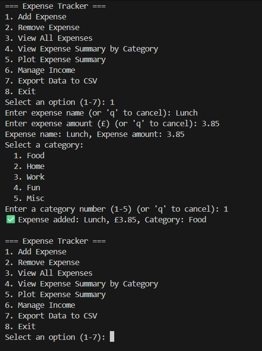
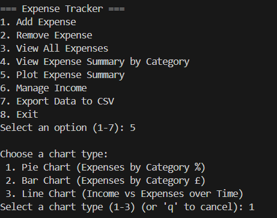
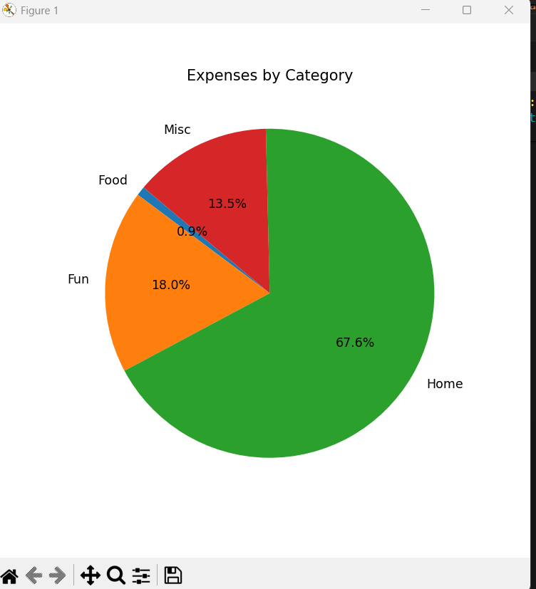
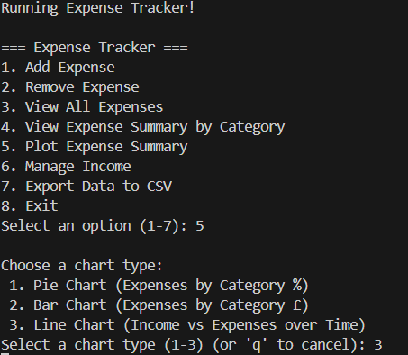
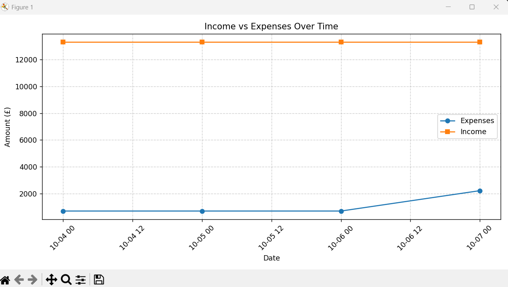

# Expense Tracker
A Python-based command-line application for recording, analysing, and visualising personal finances.  
Built to develop skills in data processing, modular programming, and data visualisation.

## Description
Expense Tracker helps users manage income and expenses directly from the terminal.  
It provides a simple interface for adding, removing, viewing, and analysing transactions,  
with automatic summaries and clear visual charts to display spending trends.

## Features
- Add, remove, and view expenses and income
- Summarise expenses by category
- Generate **bar, line, and pie charts** with Matplotlib for financial insights
- Manage income (add, remove, and view)
- Export expenses and income to a CSV file for further analysis

## Tech Stack
-**Language:** Python
-**Libraries:**
    -`matplotlib` - for data visualisation (bar, line, and pie charts)
    -`csv` - for exporting and reading data
    -`datetime` - for handling transaction dates
-**Tools:**
    -Git and GitHub - for publishing
    - VS Code / Terminal - for development and running the program

## Author / Contact
- **Finn Hyman""
- Email: Finnhyman05@gmail.com

## Installation
1. Clone the repository:
    '''bash
    git clone https://github.com/Finn-hyman/PythonProject.git
    cd PythonProject

## How to use
Run the software from main.py and follow the on screen prompts

## Screenshots

### Adding a New Expense

### Getting to Expense Summary Pie Chart

### Expense Summary Pie Chart

### Getting to Income vs Expenses Over Time

### Income vs Expenses Over Time

